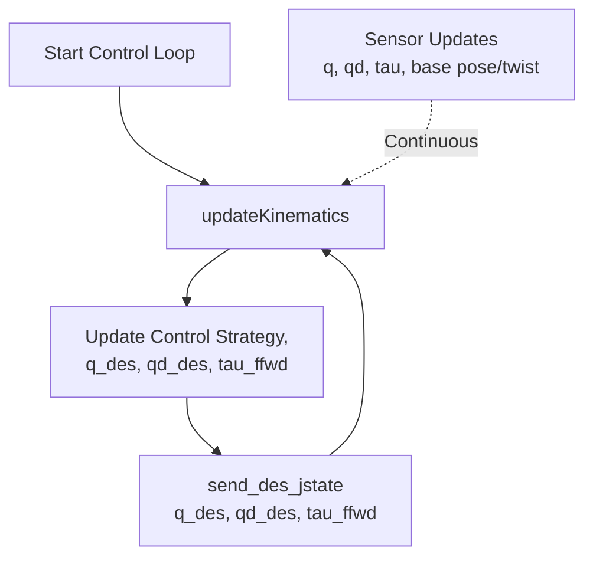

## Declare the robot class

```python
# you can inherit from other class, 
# or write everything yourself
class Go1Controller(QuadruptedController):
	def __init__(self):
		super().__init__(robot_name='go1')
	
	# other function
```

## Initialize the robot object

```python
def main(): 
	ros.init_node('go1_controller')
	controller = Go1Controller()

	# start the simulator
	...
```

## Start and Shutdown the Gazebo and RViz simulator

```python
# Starting simulator
controller.startSimulator()
ros.sleep(3.0)

# Loading model and publishers
controller.loadModelAndPublishers() 
ros.sleep(2.0)

# Initializing variables and subscribers
controller.initVars()
controller.initSubscribers()
ros.sleep(2.0)

# Running startup procedure
controller.startupProcedure()

# your control loop
rate = ros.Rate(1 / conf.robot_params['go1']['dt']
while True:
	controller.control_loop()
	rate.sleep()
	
# shutdown the simulator
print("Shutting down controller...")
ros.signal_shutdown("killed")
controller.deregister_node()
```

## Control loop structure and flowchart

code structure

```python
def control_loop(self):
	# update kinematic first
	self.updateKinematics()
	
	# update variables
	self.q_des = ...
	self.qd_des = ...
	self.tau_ffwd = ...
	
	# send the commands to the robot
	self.send_des_jstate(self.q_des, self.qd_des, self.tau_ffwd, clip_commands=self.real_robot)
	
	# log or plot data if you need
	self.logData()
	self.plotData()
	
	# draw the force diagram on RViz
	for leg in range(4):
		self.ros_pub.add_arrow(..., "green")
		if (self.use_ground_truth_contacts):
			self.ros_pub.add_arrow(..., "red")
	self.ros_pub.publishVisual()
```

flowchart

